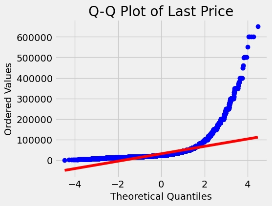

# House Price Prediction Project

### Project Overview
This project aims to build a machine learning model to predict house prices. The project is divided into multiple phases, with the first phase dedicated to data cleaning and manipulation. The subsequent phases will involve model training, evaluation, and deployment.

# Data Source and Statistics
The dataset used in this project is sourced from [Yandex Reality][def]. The dataset contains various features such as the size of the house, the number of rooms, first_day_exposition, last_day_exposition, last_price, number of floors represented by floor, floor, open_plan, rooms, studio, area, kitchen_area	living_area, agent_fee, renovation and more, which are used to predict the final sale price (last_price).

[def]: https://realty.yandex.ru

The data consisted of both rent and and sell. Since our goal was to predict the rent price, we only extracted the rent data. 

```python
# Split data into rent and sell

rent_df = spb_df[spb_df.offer_type == 2]
sell_df = spb_df[spb_df.offer_type == 1]
```

**Below is the descriptive statistics and some EDA of the data**
 - descriptive statistics

 


# 1.0 **Data cleaning and exploration**
After extracting the rent data, I explored and cleaned the data in other to prepare it for the modeling. 

The total rent data was : `Total rent data size: 171186`

Looking at the **mean** and the **median** of the rent data, it showed that, the data is not normally distributed or is slightly skewed. When the mean is greater than the median, it typically implies that the distribution is right-skewed, meaning there are some larger values (potential outliers) pulling the mean higher than the median. Conversely, if the mean is less than the median, the distribution is left-skewed.

In my example, with the mean rent price being higher than the median, it suggests there might be some higher-priced outliers pulling the mean upwards.

```python
# Check median and mean price of rent
rent_median_price = rent_df.last_price.median()
rent_mean_price = rent_df.last_price.mean()
print("Rent median price: {}".format(rent_median_price))
print("Rent mean price: {}".format(rent_mean_price))
```
ouput
```python
Rent median price: 25000.0
Rent mean price: 31719.256638977487
```

Due to this some further investigations were done. I then proceeded to make some data visualization to check the distribution of the target variable


- Q-Q plot




Based on the visualization above, I cleaned the data by dealing with the extreme outliers. After cleaning the house rent data from the extreme outliers, however the data was still right skewed which is normal for house rent prices due the following factors:
- Market Dynamics: Rental prices are often influenced by market dynamics, including supply and demand. In areas where demand for rental properties exceeds supply, rental prices tend to increase, leading to right-skewness in the distribution of prices.
- Location and Amenities: Properties located in desirable areas with convenient access to amenities such as schools, parks, public transportation, and shopping centers tend to command higher rents. As a result, rental prices for such properties can be right-skewed.
- Property Features: Rental prices can vary based on the features and characteristics of the property, such as size, number of bedrooms, quality of construction, and amenities (e.g., swimming pool, gym). Properties with premium features generally have higher rents, leading to right-skewed distributions.
- Outliers: Occasionally, there may be outliers in the rental price data, such as exceptionally high rents for luxury properties or exceptionally low rents for subsidized housing. These outliers can contribute to right-skewness in the distribution.

Taking the logarithm can help normalize the distribution of the variable, making it more symmetrical and approximately normally distributed.

- **log price visualization**


The next step in my data cleaning processs was to deal with missing values.

```python
missing = rent_df_cleaned.isnull().sum()
missing = missing[missing>0]
missing.sort_values(inplace=True)
missing.plot.bar()
```


The next step was that, I imputed all the missing values with simpleImputer

```python
from sklearn.impute import SimpleImputer

# Define columns with missing values
columns_with_missing = ['kitchen_area', 'living_area']

imputer = SimpleImputer(strategy='median')


rent_df_cleaned_spb_new[columns_with_missing] = imputer.fit_transform(rent_df_cleaned_spb_new[columns_with_missing])

rent_df_cleaned_spb_new['renovation'].fillna(0.0, inplace=True)

print(rent_df_cleaned_spb_new.isnull().sum())

# Impute missing values for 'agent_fee'

rent_df_cleaned_spb_new['agent_fee'] = imputer.fit_transform(rent_df_cleaned_spb_new[['agent_fee']])

# Check missing values after imputation
missing_values = rent_df_cleaned_spb_new.isnull().sum() / len(rent_df_cleaned_spb_new)
print(missing_values)
```

- ### Exploring data
The next step was to explore the data especially the relationship between the target variable and the features. 


- To see the relationship between variables in order to avoid multicollinearity problem, I made a correlation matrix


Now we can see that the features are not highly correlated. The highest correlation was 0.78. which was between our target and the area.Which was okay and doesn't mean multicollinearity.

- ### Finally, I tried to explore the categorical variables as well.


In order to have the data in their right format, I converted open plan and studio to integers as they were floats

```python
rent_df_cleaned_spb_new['open_plan'] = rent_df_cleaned_spb_new['open_plan'].astype('int')
rent_df_cleaned_spb_new['studio'] = rent_df_cleaned_spb_new['studio'].astype('int')
```

As you we saw in the correlation matrix, the kitchen area had less than 5 correlation with the rent price hence it is good idea to drop this feature, I also dropped floor and studio features
and saved the final cleaned dataset.

```python
rent_df_cleaned_spb_new.drop(columns=['kitchen_area','floor','studio'], inplace=True)
```

# 2. Model building and tuning

# Machine Learning Project Report

## Summary
This part involves building and evaluating several machine learning models for a regression task. The goal is to predict a target variable based on a set of features. Below is a summary of the models tested and their performance metrics.

## Models Tested
1. **Decision Tree Regressor**
   - Framework: scikit-learn
   - Hyperparameters: 
     - `max_depth`: 10
     - `max_features`: 'auto'
     - `min_samples_leaf`: 10
     - `min_samples_split`: 2
   - Metrics: 
     - MAE: 0.3577
     - MSE: 0.4120
     - RMSE: 0.6419

2. **Random Forest Regressor**
   - Framework: scikit-learn
   - Hyperparameters: 
     - `bootstrap`: True
     - `max_depth`: 12
     - `max_features`: 'sqrt'
     - `min_samples_leaf`: 6
     - `min_samples_split`: 11
     - `n_estimators`: 192
   - Metrics: 
     - MAE: 0.3377
     - MSE: 0.3725
     - RMSE: 0.6103

3. **Linear Regression**
   - Framework: scikit-learn
   - Metrics: 
     - MAE: 0.3819
     - MSE: 0.4127
     - RMSE: 0.6424

4. **Support Vector Regression (SVR)**
   - Framework: scikit-learn
   - Metrics: 
     - MAE: 0.3459
     - MSE: 0.4112
     - RMSE: 0.6413

5. **Gradient Boosting Regressor (GBR)**
   - Framework: scikit-learn
   - Metrics: 
     - MAE: 0.3401
     - MSE: 0.3750
     - RMSE: 0.6124

6. **XGBoost Regressor**
   - Framework: XGBoost
   - Metrics: 
     - MAE: 0.3693
     - MSE: 0.4687
     - RMSE: 0.6846

7. **Stacking Regressor** (Final Model)
   - Framework: scikit-learn
   - Metrics: 
     - MAE: 0.3355
     - MSE: 0.3638
     - RMSE: 0.6032

## Conclusion
Based on the evaluation metrics, the stacking regressor performed the best among the models tested. Stacking combines the predictions of multiple models to improve overall performance. This final model can be deployed for prediction tasks.

# 3. MODEL DEPLOYMENT USING FLASK AND DOCKERFILE

## How to Install and Run the App with a Virtual Environment and how to open the port

At this part I will give instructions on how you can used the final model which was saved with joblib to deploy the model into production using flask and dockerfile and also postman.

### Prerequisites

- Ensure you have visual studio installed on your system and install all neccessary extensions like python, remote ssh, github, flask etc.
- You'll need an SSH key to connect to your virtual machine.

### Steps to Set Up and Run the App
First of all create a folder where you would like to store all the neccessary files we have created. After that you can git pull this repository then continue with the following steps using the terminal in visual studio or connect to any terminal like git bash or use the cmd terminal or any other. However I will describe all the steps I took in general.

1. **Connect to Your Virtual Machine:**

   Use SSH to connect to your virtual machine in Yandex Cloud. For example, use the following command in your terminal:
   ```bash
   ssh username@your_vm_ip_address
   ```
2. **Create a Virtual Environment:**

     In the terminal, navigate to the directory where you want to create your virtual environment and run:
    ```bash
    python -m venv .venv
    ```

3. **Activate the Virtual Environment:**

     Activate the virtual environment using the following command:
     ```bash
     source .venv/bin/activate
     ```
4. **Install Required Packages:**


    Once the virtual environment is activated, install all necessary packages. Typically, you would have a requirements.txt file. Install the packages using:
    ```bash
    pip install -r requirements.txt
    ```
5. **Run the app.py file**


     The app.py contains a flask code like this:
    
    
```python
from flask import Flask, request
import joblib
import numpy as np

MODEL_PATH = "mlmodels/model.pkl"
SCALER_X_PATH = "mlmodels/scaler_x.pkl"
SCALER_Y_PATH = "mlmodels/scaler_y.pkl"

app = Flask(__name__)

model = joblib.load(MODEL_PATH)
sc_x = joblib.load(SCALER_X_PATH)
sc_y = joblib.load(SCALER_Y_PATH)

@app.route('/predict_price', methods=['GET'])
def predict():
    args = request.args
    open_plan = args.get('open_plan', default=-1, type=int)
    rooms = args.get('rooms', default=-1, type=int)
    area = args.get('area', default=-1, type=float)
    living_area = args.get('living_area', default=-1, type=float)
    agent_fee = args.get('agent_fee', default=-1, type=float)
    renovation = args.get('renovation', default=-1, type=int)

    x = np.array([open_plan, rooms, area, living_area, agent_fee, renovation]).reshape(1, -1)
    x = sc_x.transform(x)

    result = model.predict(x)
    result = sc_y.inverse_transform(result.reshape(1, -1))

    return str(result[0][0])

if __name__ == '__main__':
    app.run(debug=True, port=7774, host='0.0.0.0')
```

Then run the app.py in your terminal like this:
```bash
python app.py
```

7. **Test the Flask App:**

Use Postman or any other API testing tool to test the Flask app. For example, you can use the following URL to test:

```bash
http://your_vm_ip_address:7774/predict_price?open_plan=1&rooms=4&area=80&living_area=80&agent_fee=100&renovation=5
```
*Replace your_vm_ip_address with the actual IP address of your virtual machine.*


# Information about Dockerfile and it’s content
As of the time my docker file was created, docker nhad not been blocked in Russia and also I had a vpn hence I did not use the work around path in using docker. before you install the dockerfile its a good idea to deactivate the virtual environment.

1. I installed docker with the following command from the docker [website](https://docs.docker.com/engine/install/ubuntu/).


```bash
# Add Docker's official GPG key:
sudo apt-get update
sudo apt-get install ca-certificates curl
sudo install -m 0755 -d /etc/apt/keyrings
sudo curl -fsSL https://download.docker.com/linux/ubuntu/gpg -o /etc/apt/keyrings/docker.asc
sudo chmod a+r /etc/apt/keyrings/docker.asc

# Add the repository to Apt sources:
echo \
  "deb [arch=$(dpkg --print-architecture) signed-by=/etc/apt/keyrings/docker.asc] https://download.docker.com/linux/ubuntu \
  $(. /etc/os-release && echo "$VERSION_CODENAME") stable" | \
  sudo tee /etc/apt/sources.list.d/docker.list > /dev/null
sudo apt-get update
```

```bash
sudo apt-get install docker-ce docker-ce-cli containerd.io docker-buildx-plugin docker-compose-plugin
```

```bash
sudo docker run hello-world
```
To be able to add our user and be able to use docker I did the following steps

```bash
sudo groupadd docker
```

```bash
sudo usermod -aG docker $USER
```
```bash
newgrp docker
```

```bash
#verify that its working
docker run hello-world
```

After installing the bash, I created the dockerfile which was like done this below:

```python
FROM ubuntu:20.04
LABEL Maintainer="Ahmed"  email="st11078@gsom.spbu.ru"
RUN apt-get update -y
COPY . /opt/gsom_predictor
WORKDIR /opt/gsom_predictor
RUN apt install -y python3-pip
RUN pip3 install -r requirements.txt
CMD python3 app.py
```

My docker image is based on the `Ubuntu 20.04`

To build the docker I run this command on my terminal 
```bash
docker build -t Ahmedcm/gsom_e2e_24:v.0.1 .
```

To check if this image is built, I used:
```bash
docker images
```


# How to run the docker

```bash
docker run --network host -d ahmedcm/gsom_e2e_24:v.0.1
```


# How to run app using docker and which port it uses

Use postman port 7774 just like I used above for the flask app.
```bash
http://your_vm_ip_address:7774/predict_price?open_plan=1&rooms=4&area=80&living_area=80&agent_fee=100&renovation=5
```